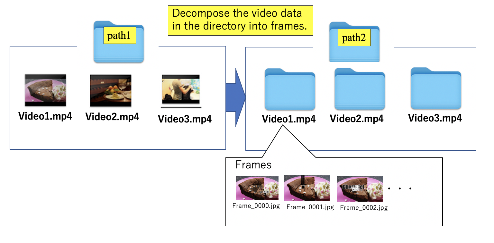
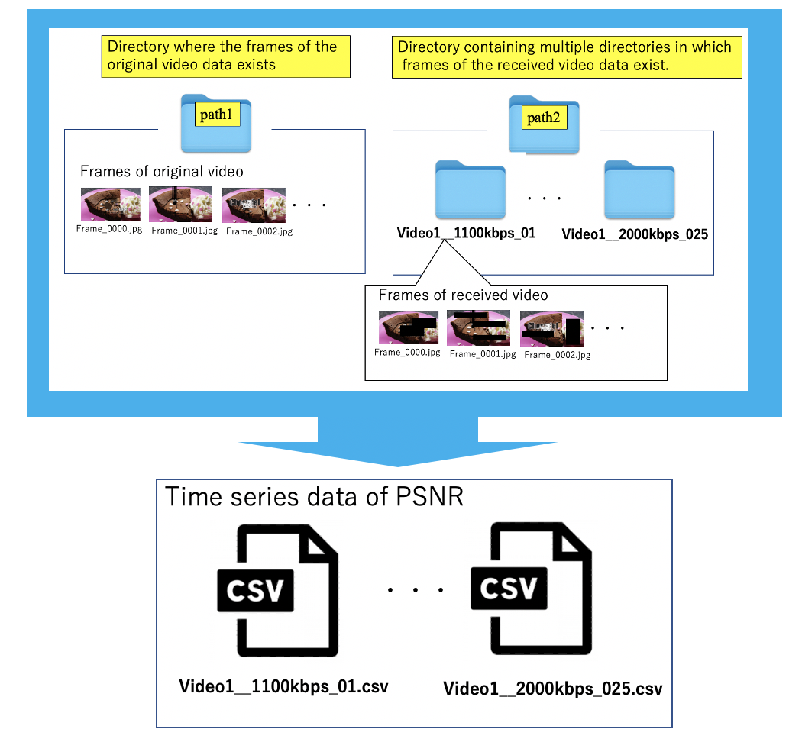
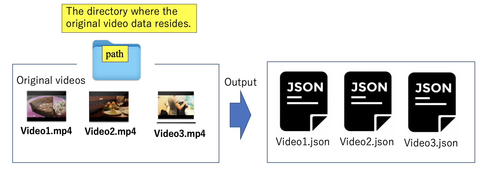
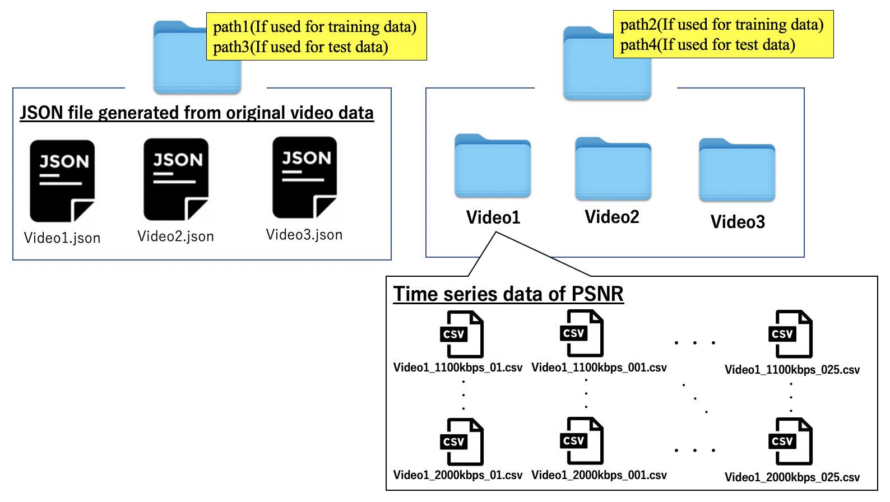

# TU AI/ML in 5G Challenge  (PS-031-NEC, Japan)
Theme : Network State Estimation by Analyz-ing Raw Video Data (NEC, Japan)

# Environment
- Python 3.7.2
- Keras 2.3.1
- Tensorflow 2.0.0
- OpenCV 3.4.2
- Ffmpeg 4.3.1

# Problem statement
You can check the details of the problem statement via [this link](https://www.ieice.org/~rising/AI-5G/#theme1).

# Date Set
The data set of Theme 2 can be downloaded [here](https://www.ieice.org/~rising/AI-5G/dataset/theme2-NEC/dataset_and_issue.tar.gz).


# Brief usage

## (Step1) Decomposition of raw video data into frames
In this step, the video data is decomposed into frames. [OpenCV](https://opencv.org/) is used for the decomposition process.

example of run: 
```
ecomposingVideo_into_Frames.py [path1] [path2]
```

Description of the arguments given to the program : 

- [*path1*] : Path to the directory containing the video data to be decomposed into frames. If there is more than one video data in the directory, process them all.
- [*path2*] : The path to the directory that will output the frames decomposed by video. If the directory does not exist, a new one will be created.

See the image below for an overview of the paths specified by the arguments.


## (Step2) Calculating Time Series Data for Peak Signal to Noise Ratio (PSNR)
In this step, we use the frame group generated in (Step 1). Comparing the frames of the original video and the frames of the received video, the time series data of PSNR is calculated. The PSNR calculation process uses [OpenCV](https://opencv.org/).

example of run: 
```
CalcPSNR.py [path1] [path2]
```

Description of the arguments given to the program : 

- [*path1*] : Path to the directory where the frames of the original video data reside
- [*path2*] : Path to the Directory containing multiple directories in which frames of the received video data exist.

See the image below for an overview of the paths specified by the arguments.


## (Step3) Extraction of information about the frames that make up the original video data
In this step, the video data is analyzed to obtain frame-by-frame information.

We use [FFmpeg](https://ffmpeg.org/) in the program to extract information from the frames that make up a video.  
When this program is executed, the information of the processed original video data is output in JSON format.  The output file contains frame-by-frame information. In the following steps, we will use the information about frame size from this information.

Example of run: 
```
Extract_FrameInformation.sh [path] 
```
Description of the arguments given to the program : 

- [*path*] : Path to the directory containing the video files to be processed

See the image below for an overview of the paths specified by the arguments.



## (Step4) Model training and network state estimation 
Training and Testing the model using the PSNR time series data calculated in (Step 2) and the frame size information of the frames that make up the original video extracted in (Step 3).

Example of run: 
```
python3 Solusion.py [path1] [path2] [path3] [path4]
```

Description of the arguments given to the program : 

- [*path1*] : Path to the directory where the JSON data is exist (for training)  
- [*path2*] : Path to the directory where the PSNR time series data is exist (for training)  
- [*path3*] : Path to the directory where the JSON data is exist (for test)  
- [*path4*] : Path to the directory where the PSNR time series data is exist (for test)  

See the image below for an overview of the paths specified by the arguments.


# Performance Evaluation
Please refer to our [report](https://github.com/ITU-AI-ML-in-5G-Challenge/PS-031.1_NEC_JOJO/blob/main/ITU_Challenge_FinalConference_JOJO%20.pdf) !!
